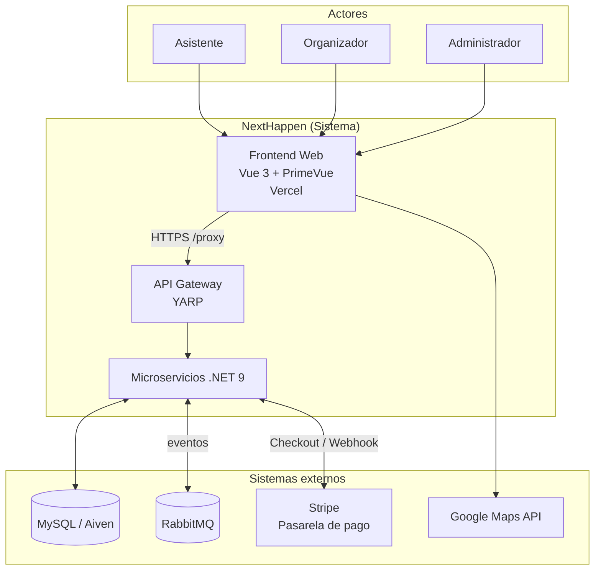
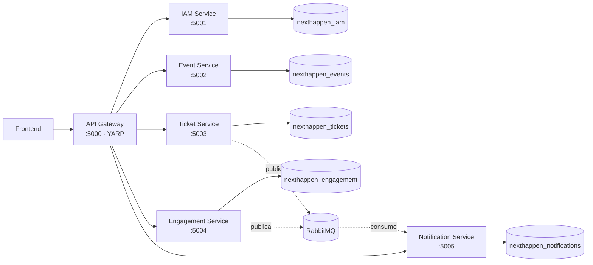
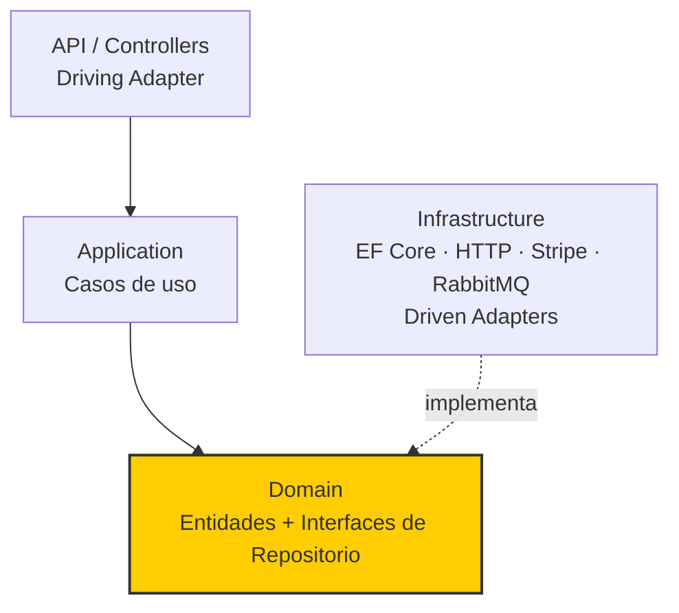
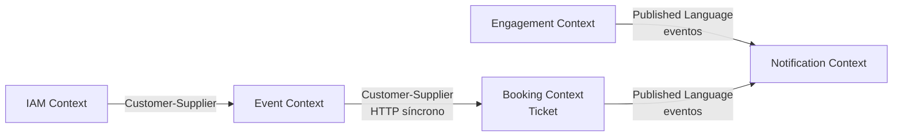
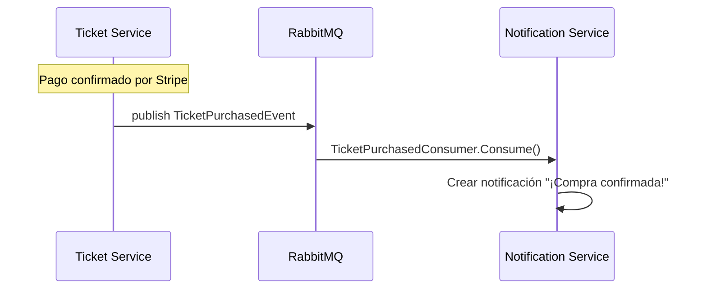
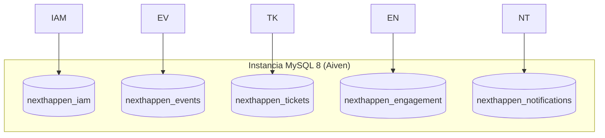
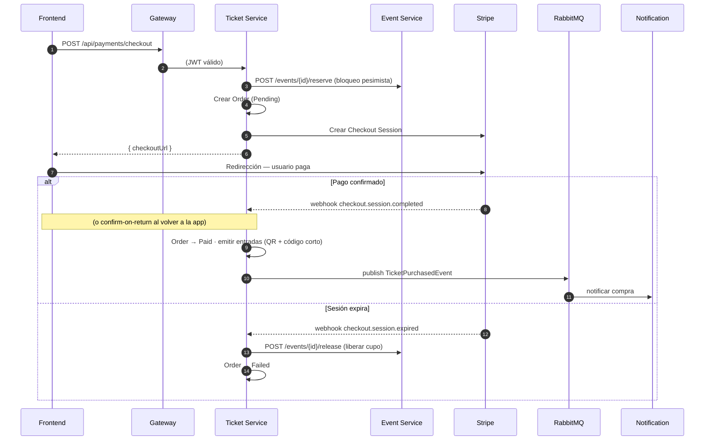
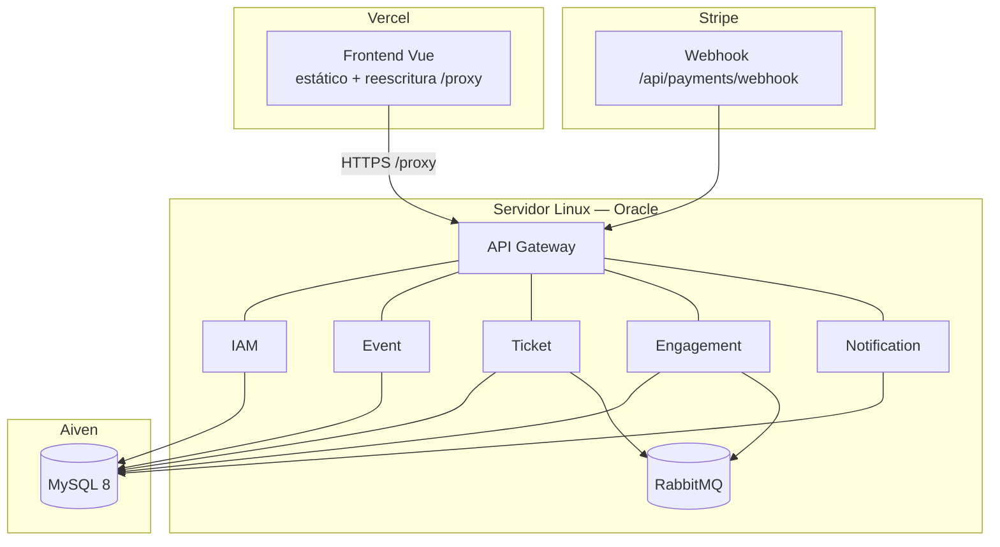

# NextHappen — Documento de Arquitectura de Software

> Documento técnico de referencia. Describe el sistema **tal como está implementado**,
> clasificando sus estilos arquitectónicos y justificándolos con evidencia del código.

---

## 1. Clasificación arquitectónica (resumen ejecutivo)

NextHappen **no responde a un único estilo arquitectónico**, sino a una **combinación
deliberada de estilos** que operan en distintos niveles de abstracción. Clasificar el
sistema con una sola etiqueta sería impreciso. La caracterización correcta es:

| Nivel | Estilo arquitectónico | Rol en el sistema |
|-------|-----------------------|-------------------|
| **Macro (sistema)** | **Microservicios** | Descomposición del sistema en servicios independientes por *bounded context*, con despliegue y base de datos independientes. |
| **Micro (por servicio)** | **Hexagonal / Clean Architecture (Ports & Adapters)** | Organización interna de cada microservicio en capas concéntricas con el dominio en el núcleo. |
| **Comunicación asíncrona** | **Event-Driven Architecture (EDA)** | Publicación/suscripción de eventos de dominio vía un *message broker* para desacoplar servicios. |
| **Comunicación síncrona / borde** | **API Gateway** | Punto único de entrada que enruta, autentica y limita el tráfico hacia los servicios. |
| **Método de diseño transversal** | **Domain-Driven Design (DDD)** | Guía el modelado (bounded contexts, agregados, entidades, value objects) tanto estratégico como táctico. |

> **En una frase:** *NextHappen es un sistema distribuido con arquitectura de **microservicios**
> como estilo macro, **hexagonal/clean** por servicio como estilo micro, comunicación
> **orientada a eventos (EDA)** para lo asíncrono a través de un **API Gateway**, y **DDD**
> como método de diseño.*

---

## 2. Stack tecnológico implementado

| Área | Tecnología |
|------|-----------|
| Backend | **.NET 9 (ASP.NET Core Web API)** |
| Frontend | **Vue 3 + PrimeVue + Vite** |
| API Gateway | **YARP (Yet Another Reverse Proxy)** |
| Base de datos | **MySQL 8** (gestionada en **Aiven**), una BD lógica por servicio |
| Mensajería | **RabbitMQ + MassTransit** |
| Pagos | **Stripe** (Checkout + Webhooks) |
| Contenedores | **Docker + Docker Compose** |
| Despliegue | Backend en **servidor Linux (Oracle)**, Frontend en **Vercel**, BD en **Aiven** |
| Autenticación | **JWT (Bearer)** validado en el gateway y en cada servicio |

> **Nota de honestidad técnica:** algunas secciones del diseño original describían
> persistencia políglota (PostgreSQL + MongoDB + Cosmos), Redis (caché), Eureka (service
> discovery) y despliegue en Azure AKS. **Nada de eso está implementado.** La realidad es
> MySQL en Aiven, sin caché distribuida, con destinos configurados estáticamente en YARP y
> despliegue con Docker Compose. Este documento describe lo implementado.

---

## 3. Vista de contexto (C4 — Nivel 1)



El sistema interactúa con tres tipos de usuario (asistente, organizador, administrador) y
con tres sistemas externos clave: **Stripe** (cobros), **Google Maps** (geolocalización) y
la infraestructura de mensajería/persistencia gestionada.

---

## 4. Estilo macro: Arquitectura de Microservicios

El backend se descompone en **cinco microservicios de negocio + un API Gateway**, cada uno
alineado con un *bounded context* de DDD. Cada servicio es un proyecto ASP.NET Core
independiente, se conteneriza por separado y posee su propia base de datos lógica.



### 4.1 Catálogo de servicios

| Microservicio | Puerto | Bounded Context | Responsabilidad | Base de datos |
|---------------|:------:|-----------------|-----------------|---------------|
| **IAM Service** | 5001 | IAM | Registro, login, emisión de JWT, gestión de perfiles y roles. | `nexthappen_iam` |
| **Event Service** | 5002 | Event Management | Catálogo de eventos, categorías, geolocalización, control de cupos (reserva/liberación con bloqueo pesimista), stands. | `nexthappen_events` |
| **Ticket Service** | 5003 | Booking | Pagos con Stripe, emisión de entradas (QR + código corto), validación de acceso, reembolsos, métricas de ventas. | `nexthappen_tickets` |
| **Engagement Service** | 5004 | Engagement | Favoritos, métricas de interacción, reseñas y calificaciones. **Publica** eventos de dominio. | `nexthappen_engagement` |
| **Notification Service** | 5005 | Notification | **Consume** eventos de dominio y genera notificaciones. | `nexthappen_notifications` |
| **API Gateway** | 5000 | — (infraestructura) | Enrutamiento, validación JWT perimetral, rate limiting, CORS. | — |

### 4.2 Principios de microservicios aplicados

- **Database per Service:** cada servicio es dueño de su base de datos; **ninguno accede a
  la BD de otro**. La consistencia entre servicios se logra por eventos o por llamadas HTTP
  explícitas, nunca por *shared database*.
- **Despliegue independiente:** cada servicio tiene su propio `Dockerfile` y se levanta como
  contenedor independiente en `docker-compose.yml`.
- **Responsabilidad única (SRP a nivel de servicio):** cada servicio tiene una sola razón de
  negocio para cambiar.
- **Comunicación por contratos:** entre servicios se usan DTOs y eventos versionados
  (proyecto compartido `NextHappen.Contracts`), no se comparten entidades de dominio.

---

## 5. Estilo micro: Arquitectura Hexagonal / Clean (por servicio)

Internamente, **cada microservicio** está organizado según los principios de la
**Arquitectura Hexagonal (Ports & Adapters)**, también conocida como **Clean/Onion
Architecture**. La estructura de carpetas lo evidencia directamente:

```
services/ticket-service/
├── API/                    → Adaptadores de entrada (Driving Adapters)
│   └── Controllers/           Controllers REST (PaymentController, TicketController…)
├── Application/            → Casos de uso / Servicios de aplicación
│   ├── Services/              PaymentService, TicketService, SalesService
│   └── DTOs/                  Contratos de entrada/salida
├── Domain/                 → NÚCLEO (reglas de negocio, sin dependencias externas)
│   ├── Entities/             Ticket, Order  (Aggregates)
│   └── Repositories/         ITicketRepository, IOrderRepository  (PORTS)
└── Infrastructure/         → Adaptadores de salida (Driven Adapters)
    ├── Persistence/          TicketDbContext + Repositorios EF Core (ADAPTERS)
    ├── Http/                 EventCatalogClient (adaptador a otro servicio)
    └── Payments/             StripeOptions (adaptador a Stripe)
```

### 5.1 Regla de dependencia



- **Las dependencias apuntan hacia el dominio.** El `Domain` no conoce a EF Core, ni a
  Stripe, ni a HTTP: define **interfaces (puertos)** como `ITicketRepository` y
  `IOrderRepository`.
- **La infraestructura implementa esos puertos** (`TicketRepository`, `OrderRepository`)
  → son los **adaptadores**. Se inyectan por **Inyección de Dependencias** en `Program.cs`.
- Los **Controllers** son *driving adapters*: traducen HTTP a llamadas de casos de uso.
- Clientes como `EventCatalogClient` (HTTP hacia event-service) y el wrapper de Stripe son
  *driven adapters* que aíslan al dominio de los detalles de integración externa (patrón
  **Adapter**).

Esto permite, por ejemplo, cambiar MySQL por otra BD, o Stripe por otra pasarela,
**sin tocar el dominio ni los casos de uso**.

---

## 6. Domain-Driven Design (DDD)

DDD es el **método de diseño transversal** del sistema, tanto en su vertiente estratégica
como táctica.

### 6.1 Diseño estratégico — Bounded Contexts y Context Map



Cada microservicio **es** un bounded context. Las relaciones del *context map*:

- **Customer-Supplier (síncrono):** el Booking Context (Ticket) consume al Event Context vía
  HTTP para consultar precios y reservar/liberar cupos (`EventCatalogClient`).
- **Published Language (asíncrono):** Engagement y Booking publican **eventos de dominio**
  en un lenguaje común (`NextHappen.Contracts`), que Notification consume.

### 6.2 Diseño táctico — Agregados y Value Objects

| Agregado (Raíz) | Contexto | Entidades / Value Objects |
|-----------------|----------|---------------------------|
| **User** | IAM | VO: Email, PasswordHash, Role |
| **Event** | Event | VO: `EventDateRange` (StartDate/EndDate), Location, Category; Entidad: `AssignedStand` |
| **Ticket** | Booking | VO: `TicketStatus` (Active/Used/Refunded/Cancelled), QrCode, ShortCode |
| **Order** | Booking | VO: `OrderStatus` (Pending/Paid/Failed/Refunded), Currency |
| **Review** | Engagement | VO: Rating (1–5) |

El agregado protege **invariantes de negocio**. Ejemplos reales en el código:

- `Event.ReserveSeats()` lanza excepción si no hay cupos suficientes.
- `Review.SetContent()` valida que la calificación esté entre 1 y 5.
- `Order` solo transiciona a `Paid` cuando Stripe confirma el cobro (idempotente).

---

## 7. Estilo de comunicación asíncrona: Event-Driven Architecture (EDA)

Los servicios se comunican de forma **asíncrona y desacoplada** mediante un *message broker*
(**RabbitMQ**), usando **MassTransit** como abstracción de bus de mensajes. Se aplica el
patrón **Publish/Subscribe**.

### 7.1 Eventos de dominio (Published Language)

Definidos en el proyecto compartido `shared/NextHappen.Contracts/Events/DomainEvents.cs`:

| Evento | Publicado por | Consumido por | Disparador |
|--------|---------------|---------------|------------|
| `EventSavedEvent` | Engagement | Notification | Usuario guarda un evento en favoritos |
| `EventViewedEvent` | Engagement | Notification | Usuario ve el detalle de un evento |
| `TicketPurchasedEvent` | **Ticket** | Notification | Pago confirmado → entradas emitidas |
| `EventCreatedEvent` / `EventDeletedEvent` | Event | (extensible) | Alta/baja de eventos |

### 7.2 Flujo pub/sub



**Beneficio arquitectónico:** el Ticket Service **no conoce** al Notification Service; solo
publica un hecho de dominio. Se pueden añadir nuevos consumidores (email, push, analítica)
sin modificar al publicador — **desacoplamiento temporal y de implementación**.

---

## 8. API Gateway (patrón de borde)

Un único **API Gateway (YARP)** es el punto de entrada del sistema. Responsabilidades:

- **Enrutamiento (Reverse Proxy):** mapea rutas a clústeres de servicios (configuración en
  `appsettings.json` → `ReverseProxy.Routes` / `Clusters`).
- **Seguridad perimetral:** valida el **JWT** antes de reenviar (defensa en profundidad: los
  servicios lo re-validan).
- **Rate Limiting:** ventana fija de 100 req/min por IP.
- **CORS:** whitelist configurable del origen del frontend.

> **Detalle de diseño relevante:** las rutas específicas (`/api/events/{id}/reviews`,
> `/api/events/{id}/sales`) deben tener mayor prioridad que la ruta *catch-all* de eventos
> (`/api/events/{**catch-all}`). Esto se resuelve con el campo `Order` de YARP, evitando que
> la ruta genérica "capture" las peticiones destinadas a otros microservicios.

---

## 9. Persistencia: Database per Service



- **ORM:** Entity Framework Core con el proveedor **Pomelo** para MySQL.
- **Aislamiento lógico:** una base de datos por servicio dentro de una misma instancia
  gestionada (Aiven). Ningún servicio consulta la BD de otro.
- **Control de concurrencia:** el Event Service usa **bloqueo pesimista**
  (`SELECT ... FOR UPDATE`) dentro de una transacción para reservar cupos y evitar
  sobreventa en picos de demanda.

---

## 10. Patrones de diseño aplicados

### Patrones arquitectónicos / de integración

| Patrón | Dónde |
|--------|-------|
| **Microservices** | Descomposición macro del backend |
| **API Gateway** | YARP como único punto de entrada |
| **Database per Service** | Una BD por microservicio |
| **Publish/Subscribe (EDA)** | RabbitMQ + MassTransit |
| **Ports & Adapters (Hexagonal)** | Estructura interna de cada servicio |
| **Ticket Reservation Pattern** | Reservar cupo → pagar → emitir / liberar si expira |
| **Idempotent Consumer** | Webhook de Stripe no duplica entradas ante reintentos |
| **Backend for Frontend (parcial)** | El gateway agrega el acceso para el cliente web |

### Patrones de diseño (GoF) y tácticos

| Patrón | Dónde |
|--------|-------|
| **Repository** | `ITicketRepository`, `IEventRepository`, etc. (puerto) + implementación EF |
| **DTO (Data Transfer Object)** | `CheckoutRequest`, `EventResponse`, `ReviewResponse`… desacoplan dominio de la API |
| **Adapter / Wrapper** | `EventCatalogClient` (HTTP entre servicios), wrapper de Stripe |
| **Options** | `StripeOptions` enlazado desde configuración/entorno |
| **Dependency Injection** | Registro de servicios y repositorios en cada `Program.cs` |
| **Strategy (implícito)** | Estados de `Ticket`/`Order` que gobiernan el comportamiento |

---

## 11. Flujo arquitectónico clave: compra de entradas

Ilustra cómo colaboran los estilos (síncrono + asíncrono + externo) y garantiza que
**una entrada solo se emite tras un pago real y confirmado**.



Puntos arquitectónicos destacables:

- **Emisión post-pago e idempotente:** el ticket nunca se crea antes de la confirmación, y
  reintentos del webhook no duplican entradas.
- **Doble mecanismo de confirmación:** *webhook* (autoritativo) + *confirm-on-return*
  (respaldo síncrono al volver de Stripe) → resiliencia ante fallos de entrega del webhook.
- **Transacción de compensación:** si el pago expira, se **libera el cupo** reservado
  (consistencia eventual entre Ticket y Event contexts).

---

## 12. Arquitectura del Frontend

El cliente web (Vue 3) también sigue una **arquitectura modular por dominio** con separación
en capas, espejando el enfoque del backend.

```
src/
├── app/                     → Composición: router, i18n, store (Pinia), main.js
├── modules/                 → Módulos por dominio (feature-based)
│   ├── events/              →   presentation/ (vistas) · application/ (stores) · infrastructure/ (api)
│   ├── iam/  · tickets/  · organizer/  · metrics/  · notifications/  · stands/
└── shared/                  → Transversal
    ├── infrastructure/      →   cliente HTTP (axios) con interceptores de token y 401
    ├── presentation/        →   Navbar, headers, componentes comunes
    └── assets/              →   sistema de diseño (tokens, estilos)
```

- **Separación de capas en el cliente:** `presentation` (vistas Vue) → `application`
  (stores/estado) → `infrastructure` (clientes API). Espejo del patrón del backend.
- **Cliente HTTP centralizado:** un único `axios` con interceptores que adjuntan el JWT y
  manejan los `401` de forma global (patrón **Interceptor**).
- **Enrutamiento y guards:** Vue Router con *navigation guards* por rol (User/Organizer).
- **Estado:** Pinia. **i18n:** vue-i18n.

---

## 13. Topología de despliegue



- **Frontend:** Vercel (build estático + reescritura `/proxy → backend`).
- **Backend:** contenedores Docker orquestados con Docker Compose en un servidor Linux
  (Oracle Cloud).
- **Base de datos:** MySQL gestionada en Aiven.
- **Pagos:** webhook de Stripe apuntando al dominio público del gateway.

---

## 14. Atributos de calidad y tácticas

| Atributo de calidad | Táctica arquitectónica implementada |
|---------------------|-------------------------------------|
| **Escalabilidad** | Servicios independientes y sin estado (stateless) tras el gateway; escalado horizontal por contenedor. |
| **Disponibilidad / Resiliencia** | Comunicación asíncrona (RabbitMQ) que desacopla productores de consumidores; doble confirmación de pago (webhook + confirm-on-return); transacciones de compensación. |
| **Seguridad** | JWT en el borde y en cada servicio; CORS con whitelist; rate limiting; secretos en variables de entorno (no versionados). |
| **Consistencia de datos** | Bloqueo pesimista para evitar sobreventa; emisión de entradas idempotente. |
| **Mantenibilidad** | Hexagonal/Clean por servicio (dominio aislado de infraestructura); DDD; principios SOLID/DRY/KISS. |
| **Interoperabilidad** | APIs REST documentadas con OpenAPI/Swagger; contratos de eventos compartidos y versionables. |

---

## 15. Seguridad (vista transversal)

- **Autenticación:** JWT emitido por IAM Service; validado en el **gateway** (perimetral) y
  **re-validado en cada microservicio** (defensa en profundidad).
- **Autorización:** por rol (`User`, `Organizer`, `Admin`) mediante `[Authorize(Roles=...)]`
  y verificación de pertenencia (ej. el organizador solo edita sus eventos; el usuario solo
  ve sus entradas).
- **Gestión de secretos:** claves de Stripe, JWT y credenciales de BD viven en `.env`
  (gitignorado) / variables de entorno del hosting. **Nunca en el repositorio.**
- **Superficie de red:** el frontend solo habla con el gateway (`/proxy`); los servicios no
  se exponen directamente al cliente.

---

## 16. Trade-offs y decisiones de diseño

| Decisión | Beneficio | Costo / Trade-off |
|----------|-----------|-------------------|
| Microservicios en lugar de monolito | Despliegue y escalado independiente, aislamiento de fallos | Complejidad operativa, latencia de red, consistencia eventual |
| Database per Service | Bajo acoplamiento, autonomía | Sin JOINs entre contextos; consultas cross-service por API/eventos |
| EDA (RabbitMQ) | Desacoplamiento, extensibilidad | Complejidad de infraestructura, depuración distribuida |
| `EnsureCreated` (sin migraciones EF) | Simplicidad para el entorno académico | Los cambios de esquema no se aplican solos en producción (requieren SQL/reset) |
| Hexagonal por servicio | Dominio testeable y aislado | Más *boilerplate* (interfaces + adaptadores) |
| Confirm-on-return además del webhook | Robustez ante fallos de webhook | Lógica de confirmación duplicada (mitigada por idempotencia) |

---

## 17. Conclusión

NextHappen es un **sistema distribuido híbrido** cuya arquitectura se explica por capas de
estilos complementarios: **microservicios** para dividir el sistema por *bounded contexts*,
**arquitectura hexagonal/clean** para mantener cada servicio mantenible y con el dominio en
el centro, **EDA** para la comunicación asíncrona desacoplada, un **API Gateway** para el
acceso unificado y seguro, y **DDD** como método de diseño que da coherencia a todo el
conjunto. Esta combinación prioriza **mantenibilidad, escalabilidad y desacoplamiento**,
asumiendo a cambio la complejidad inherente a los sistemas distribuidos.
